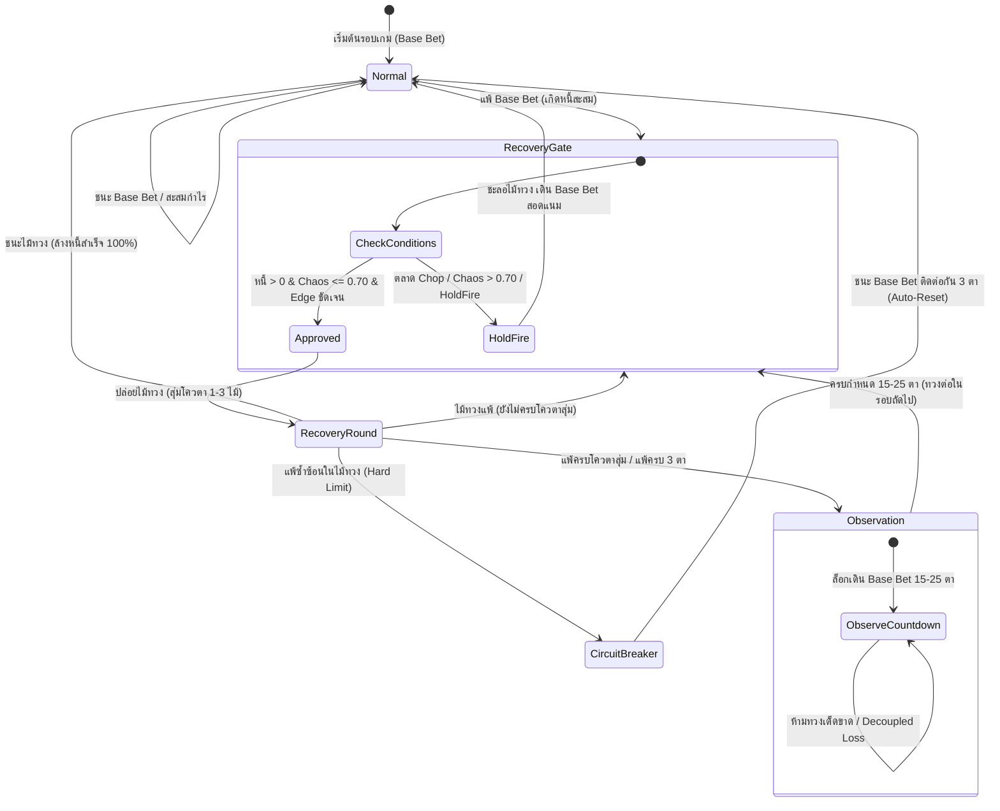

# 📖 Golden_p — เอกสารสรุปภาพรวมสถาปัตยกรรมและระบบทั้งหมด (System Overview & Technical Specification)

> **Golden_p** คือแอปพลิเคชัน Flutter สำหรับการเทรดและเล่นเกมเชิงสถิติ (Towers, Mines, Gems / Polpick) อัตโนมัติตลอด 24/7 บนระบบปฏิบัติการ Android ผสานการทำงานระหว่าง **Android Floating Overlay Window**, **Automated InAppWebView & DOM Injection**, **Multi-Model Cognitive AI Brain (APPI 13.4)**, และ **สถาปัตยกรรมการบริหารเงินทุนระดับสถาบัน (Anti-Wipeout Institutional Shields)** พร้อมไปป์ไลน์การเทรนโมเดล Reinforcement Learning แบบต่อเนื่องผ่าน Python Watchdog

---

## 📑 สารบัญ (Table of Contents)
1. [ภาพรวมและเป้าหมายหลักของระบบ (Core Mission)](#1-ภาพรวมและเป้าหมายหลักของระบบ-core-mission)
2. [โครงสร้างสถาปัตยกรรมระบบ (Architecture Layers)](#2-โครงสร้างสถาปัตยกรรมระบบ-architecture-layers)
3. [ระบบสมองกลและเครื่องยนต์ทำนาย (Cognitive AI & Prediction Engines)](#3-ระบบสมองกลและเครื่องยนต์ทำนาย-cognitive-ai--prediction-engines)
4. [กลไกบริหารความเสี่ยงและเกราะป้องกันพอร์ตแตก (Anti-Wipeout Shields)](#4-กลไกบริหารความเสี่ยงและเกราะป้องกันพอร์ตแตก-anti-wipeout-shields)
5. [ระบบทวงหนี้แบบสุ่ม 1–3 ตา และ Sniper Recovery Gate](#5-ระบบทวงหนี้แบบสุ่ม-13-ตา-และ-sniper-recovery-gate)
6. [วงจรการทำงานใน 1 รอบเกม (Single Round Lifecycle)](#6-วงจรการทำงานใน-1-รอบเกม-single-round-lifecycle)
7. [ระบบทำงานอัตโนมัติ 24/7 และ Continuous RL Pipeline](#7-ระบบทำงานอัตโนมัติ-247-และ-continuous-rl-pipeline)
8. [แผนผังสถาปัตยกรรมระบบ (System Architecture & State Diagrams)](#8-แผนผังสถาปัตยกรรมระบบ-system-architecture--state-diagrams)
9. [ดัชนีไฟล์สำคัญในโปรเจกต์ (Key File Directory Index)](#9-ดัชนีไฟล์สำคัญในโปรเจกต์-key-file-directory-index)

---

## 1. ภาพรวมและเป้าหมายหลักของระบบ (Core Mission)

### 🎯 เป้าหมายหลัก
- **ทำกำไรแบบยั่งยืนและไร้การหมดตัว (Zero-Wipeout Growth)**: ขจัดความเสี่ยงจากการเทหมดหน้าตัก (All-in Martingale) ด้วยการกำหนดเพดานขนาดไม้ทวงหนี้สูงสุดไม่เกิน **10% ของเงินทุนคงเหลือ**
- **รันอัตโนมัติ 24 ชั่วโมงต่อวัน (24/7 Autonomous Operation)**: มีระบบพักฟื้นรอบตา (Micro/Macro Breaks), Heartbeat Watchdog, และการตรวจจับความผิดปกติของเกม
- **เรียนรู้และปรับตัวแบบไดนามิก (On-Device Reinforcement Learning)**: ปรับน้ำหนักโมเดลตามผลแพ้ชนะจริง, บันทึก Pain Memory, และทำลายกับดัก PRNG ของคาสิโนด้วย Cryptographic Seed Rotation

---

## 2. โครงสร้างสถาปัตยกรรมระบบ (Architecture Layers)

สถาปัตยกรรมของ **Golden_p** แบ่งออกเป็น 5 เลเยอร์หลัก:

```
┌──────────────────────────────────────────────────────────────────┐
│ 1. User Interface & Android Floating Overlay Window             │
│    - DashboardView, SequenceAnalyzerView, Floating Overlay HUD   │
└──────────────────────────────────────────────────────────────────┘
                                │
▼                               ▼
┌──────────────────────────────────────────────────────────────────┐
│ 2. WebView Automation & DOM Controller Layer                     │
│    - InAppWebView, JS Injection, Virtual Clickers (M0 - M5)      │
│    - Balance Tracker & Input Field Typing Guard                  │
└──────────────────────────────────────────────────────────────────┘
                                │
▼                               ▼
┌──────────────────────────────────────────────────────────────────┐
│ 3. Cognitive AI & Multi-Model Prediction Engines (APPI 13.4)     │
│    - OmniMatrixEngine (Consensus, Chaos Index, Kelly Sizing)     │
│    - SequenceAnalyzerViewModel (N-Gram, Markov, Recency, Pain)   │
│    - ProvablyFairEngine (Seed Rotation, Nonce Tracking)          │
└──────────────────────────────────────────────────────────────────┘
                                │
▼                               ▼
┌──────────────────────────────────────────────────────────────────┐
│ 4. Institutional Risk Management & Anti-Wipeout Layer            │
│    - 4 Ironclad Shields (10% Cap, 30% DD Stop-Loss, Decoupling)   │
│    - Weighted Randomized Recovery Quota (1-3 Shots: 50/35/15%)   │
│    - Selective Recovery Gate (Sniper Recovery on High Chaos)     │
│    - Safe Haven Protocol (Reset toxic debt on 30% drawdown)      │
└──────────────────────────────────────────────────────────────────┘
                                │
▼                               ▼
┌──────────────────────────────────────────────────────────────────┐
│ 5. Autonomous 24/7 Watchdog & RL Continuous Pipeline             │
│    - Python Watchdog Daemon, ADB Bridge, Incident Reporting      │
│    - JSON State Sync, Model Weight Mutation, Sleep Cycles        │
└──────────────────────────────────────────────────────────────────┘
```

---

## 3. ระบบสมองกลและเครื่องยนต์ทำนาย (Cognitive AI & Prediction Engines)

### 3.1 `OmniMatrixEngine` (APPI 13.4 Master Cognitive Engine)
- **Consensus Voting**: ผสานโมเดลย่อย 4 ตัว (N-Gram, Markov Chains, Recency Gradient, Anti-Cluster Seeker) เพื่อลงมติเลือกช่อง A, B หรือ C
- **Normalized Shannon Entropy & Chaos Index**: คำนวณค่าความโกลาหลของผลลัพธ์ (0.00 = มีทิศทางชัดเจน, 1.00 = สุ่มสมบูรณ์แบบ/Chop)
- **Market Regime Detection**:
  - `ALPHA_EDGE`: Edge ทางคณิตศาสตร์ $\ge 2\%$, ความสอดคล้อง $\ge 3/4$ โมเดล
  - `STEADY_EDGE`: Edge ทางคณิตศาสตร์ $> 0\%$
  - `EQUILIBRIUM`: สภาวะสมดุล
  - `CHOP / HIGH_CHAOS`: ตลาดสับขาหลอก, Entropy $\ge 0.88$ $\rightarrow$ สั่ง **Hold Fire**
  - `DEFENSE`: แพ้ $\ge 3$ ตาติด หรืออยู่ในช่วงพักคูลดาวน์
- **Anti-Streak-4 Hyper Shield**:
  - *Dual Loss Escape*: เมื่อแพ้ A แล้วแพ้ B ใน Streak $\rightarrow$ ดีดหนีไป C ทันที
  - *Sticky Bomb Detection*: หากระเบิดแช่ที่เดิม $\ge 3$ ตา $\rightarrow$ บูสต์อีก 2 ช่อง $3.5\times$
  - *Cyclic Bomb Dodge*: ตรวจจับระเบิดวนตามเข็ม A $\rightarrow$ B $\rightarrow$ C
- **Sovereign Brain Veto**: สิทธิ์ยับยั้งสูงสุด หากโมเดลอื่นทำนายช่องเสี่ยง OmniMatrix จะ Veto และบังคับเลือกช่องที่ปลอดภัยที่สุด

### 3.2 `SequenceAnalyzerViewModel` & Real-Time Learning
- **N-Gram Engine**: บันทึกรูปแบบ 3–5 ตาล่าสุดเพื่อจำแนก Pattern
- **Pain Memory**: ลดค่าน้ำหนักโมเดลที่ทายผิดในตาที่โดนระเบิดอย่างเฉียบพลัน และเพิ่มรางวัลให้โมเดลที่ทายถูก
- **Instant Bomb Dodge**: เมื่อช่องใดโดนระเบิด ปลดล็อก Anchor ทันทีเพื่อเบี่ยงไปเลือกช่องปลอดภัยอื่นในตาถัดไป

---

## 4. กลไกบริหารความเสี่ยงและเกราะป้องกันพอร์ตแตก (Anti-Wipeout Shields)

ระบบติดตั้ง **4 Ironclad Institutional Shields** เพื่อตัดปัญหาพอร์ตแตก 100%:

| ลำดับเกราะ | ชื่อมาตรการ | ตรรกะการทำงาน | ผลลัพธ์ที่ได้ |
| :--- | :--- | :--- | :--- |
| **Shield 1** | **Bankroll Cap 10%** | $\text{RecoveryBet} \le \text{Balance} \times 0.10$ | ห้าม All-in หรือเบทเกิน 10% ของเงินในบัญชีเด็ดขาด แม้หนี้จะสูงเพียงใด |
| **Shield 2** | **30% Hard Drawdown Stop-Loss** | $\text{CurrentBalance} \le \text{SessionMax} \times 0.70$ | หากขาดทุนถึง 30% ของจุดสูงสุด ระบบจะตัดขาดทุนทันทีเพื่อรักษาเงินต้น 70% |
| **Shield 3** | **Observation Loss Decoupling** | ไม่นำผลแพ้ในช่วงดูเชิง 15–25 ตามาบวกทบหนี้ | ป้องกันภาวะ Debt Snowball (หนี้บวมพองจากการดูเชิง) |
| **Shield 4** | **Bad Run / Casino Counter Circuit Breaker** | ตรวจพบแพ้ $\ge 6$ ตาใน 10 ตาล่าสุด | พักระบบทันที 5 นาที เพื่อสลายกับดัก Pattern ของ RNG คาสิโน |

### 🛡️ Safe Haven Protocol (สำหรับโหมด 24/7)
เมื่อพอร์ตแตะระดับ Drawdown 30% ในขณะที่เปิดรันบอท 24 ชั่วโมง:
1. ระบบล้างหนี้สะสมที่เป็นพิษ (Toxic Debt) ทิ้งเป็น 0.00000000 ทันที
2. ปรับ Re-anchor ยอดเงินทุนเริ่มต้นใหม่เป็นยอดเงินปัจจุบัน
3. เข้าสู่โหมดพักฟื้นเดิน Base Bet นิ่งๆ 30 ตา เพื่อฟื้นฟูเสถียรภาพ

---

## 5. ระบบทวงหนี้แบบสุ่ม 1–3 ตา และ Sniper Recovery Gate

### 5.1 สุ่มโควตาทวงหนี้ถ่วงน้ำหนัก (Weighted Randomized Recovery Quota)
ขจัดจุดอ่อนของระบบมาร์ติงเกลแบบเดิมที่ทวงหนี้แข็งทื่อ 3 ไม้ติดจนหมดตัว:
- **50% (โอกาสครึ่งหนึ่ง)**: สุ่มทวงเพียง **1 ไม้** (หากพลาด ยอมถอยกลับไป Base Bet ดูเชิง 15–25 ตาทันที ตัดวงจรหนี้บวม 85%)
- **35%**: สุ่มทวง **2 ไม้**
- **15%**: สุ่มทวงเต็ม **3 ไม้**
- **Cycle 1 Protection**: ในรอบแรก เนื่องจาก Base Bet แพ้ไปแล้ว 1 ไม้ โควตาทวงจะถูกจำกัดไม่เกิน 2 ไม้เสมอ เพื่อไม่ให้แพ้เกินเพดาน 3 ตาติด

### 5.2 ระบบทายคัดกรอง Sniper Recovery Gate (`canEnterRecovery`)
ก่อนวางเงินไม้ทวงหนี้ ระบบจะตรวจสอบความพร้อมผ่าน Safety Gate:
1. **Circuit Breaker Check**: ไม่มี Circuit Breaker ค้างอยู่
2. **Consecutive Losses Ceiling**: ไม่อยู่ในสถานะแพ้ $\ge 3$ ตาติด
3. **Observation Lock**: ไม่อยู่ระหว่างช่วงดูเชิง 15–25 ตา
4. **Selective AI Evaluation**:
   - หาก `omniResult.recoveryClearance == RecoveryClearance.holdFire` $\rightarrow$ **ระงับการทวง**
   - หากค่าความโกลาหล `omniResult.chaosIndex > 0.70` $\rightarrow$ **ระงับการทวง**
   - บอทจะเดิน Base Bet ดูเชิงสอดแนม จนกว่าจะเจอจังหวะที่มีความมั่นใจสูง (Grade AAA / Edge ชัดเจน) จึงปล่อยไม้ทวงจริง

---

## 6. วงจรการทำงานใน 1 รอบเกม (Single Round Lifecycle)

ในฟังก์ชัน `_executeSmartFlow` แต่ละรอบเกมจะดำเนินไปตามลำดับ 6 ขั้นตอน:

```
[1. Balance Verification] ──► ตรวจสอบยอดเงินคงเหลือจริงผ่าน DOM JavaScript
         │
         ▼
[2. AI Brain Prediction]  ──► OmniMatrix วิเคราะห์ผล สถิติ และคำนวณ Chaos Index
         │
         ▼
[3. Recovery Gate Check]  ──► Selective Gate ตัดสินใจ: ปล่อยไม้ทวง หรือเดิน Base Bet
         │
         ▼
[4. DOM Amount Typing]    ──► พิมพ์ยอดเดิมพันลง Input Field (พร้อม Typing Guard)
         │
         ▼
[5. Virtual Button Click] ──► คลิก M0 (Start) ──► คลิกเป้าหมาย M1/M2/M3
         │
         ▼
[6. Outcome Detection]    ──► ตรวจจับ Win/Loss ──► อัปเดตหนี้/หักกำไร ──► หมุน Seed
```

---

## 7. ระบบทำงานอัตโนมัติ 24/7 และ Continuous RL Pipeline

- **Pillar 1: Circuit Breaker Hygiene**: ตัดรอบเมื่อเกิดข้อผิดพลาดซ้ำซ้อน ป้องกันการค้างของบอท
- **Pillar 2: Human Sleep Cycles**:
  - *Micro-break*: พักสั้น 5–15 วินาที ทุกๆ 10–20 ตา
  - *Macro-break*: พักยาว 10–30 นาที ทุกๆ 150–250 ตา เลียนแบบพฤติกรรมมนุษย์
- **Pillar 3: Watchdog Heartbeat**:
  - ไฟล์ `watchdog_state.json` บันทึกสถานะการเต้นของหัวใจบอทแบบเรียลไทม์
  - สคริปต์ Python `scripts/autonomous_watchdog.py` คอยตรวจสอบผ่าน ADB หากแอปค้างจะ Restart อัตโนมัติ
- **Pillar 4: Milestone Profit Banking**: บันทึกกำไรสะสมเมื่อแตะเป้าหมายหลัก และล็อกเงินต้น

---

## 8. แผนผังสถาปัตยกรรมระบบ (System Architecture & State Diagrams)

### 8.1 State Diagram: Recovery & Risk Lifecycle


### 8.2 Flowchart: Decision & Risk Shield Engine
```mermaid
flowchart TD
    A[เริ่มรอบใหม่] --> B[ดึงยอดเงินจากหน้าเว็บ Balance Check]
    B --> C{ยอดเงินลดลง > 30%?}
    C -- ใช่ --> D[🛡️ เปิด Safe Haven: ล้างหนี้เป็น 0, Re-anchor, พัก 30 ตา]
    C -- ไม่ใช่ --> E[🧠 OmniMatrix ประมวลผลทำนาย A, B, C]
    E --> F{มีหนี้สะสมคงค้างหรือไม่?}
    F -- ไม่มี --> G[เดิน Base Bet ปกติ]
    F -- มีหนี้ --> H{ผ่าน Selective Recovery Gate หรือไม่?}
    H -- ไม่ผ่าน: Chaos สูง / HoldFire --> I[🎯 Sniper HoldFire: เดิน Base Bet สอดแนม]
    H -- ผ่าน: ปลอดภัย / Grade AAA --> J[🎯 สุ่มโควตาทวง 1-3 ไม้ & คำนวณเบท (Cap 10% ทุน)]
    G --> K[คลิก M0 เริ่มเล่น -> คลิกช่องเป้าหมาย]
    I --> K
    J --> K
    K --> L{ผลลัพธ์รอบเกม?}
    L -- ชนะ --> M[หักกำไรลดหนี้สะสม / ถ้าหนี้หมดรีเซ็ตเป็น Normal]
    L -- แพ้ --> N[บันทึกหนี้จริงตามยอดเบท & หมุน Seed หนีคาสิโน]
    N --> O{แพ้ครบโควตาสุ่ม หรือแตะ 3 ตา?}
    O -- ใช่ --> P[ถอยกลับ Base Bet ดูเชิง 15-25 ตา]
    O -- ไม่ใช่ --> Q[ออกไม้ทวงถัดไปตามโควตา]
```

---

## 9. ดัชนีไฟล์สำคัญในโปรเจกต์ (Key File Directory Index)

### 📂 แกนหลักของแอปพลิเคชัน (`lib/`)
- [`lib/viewmodels/overlay_buttons_viewmodel.dart`](file:///c:/Users/Admin%20N/Desktop/Agents/golden_p/golden_p/lib/viewmodels/overlay_buttons_viewmodel.dart): **หัวใจหลักของบอท** ควบคุมลูปเกมอัตโนมัติ (`_executeSmartFlow`), ระบบทวงหนี้, State Machine, Virtual Clicker, และเกราะป้องกันพอร์ตแตก
- [`lib/engines/omni_matrix_engine.dart`](file:///c:/Users/Admin%20N/Desktop/Agents/golden_p/golden_p/lib/engines/omni_matrix_engine.dart): **สมองกลหลัก APPI 13.4** ประมวลผล Consensus, Shannon Entropy, Chaos Index, Kelly Fluid Sizing, และ Anti-Streak Rules
- [`lib/viewmodels/sequence_analyzer_viewmodel.dart`](file:///c:/Users/Admin%20N/Desktop/Agents/golden_p/golden_p/lib/viewmodels/sequence_analyzer_viewmodel.dart): ควบคุม N-Gram, Markov, สถิติย้อนหลัง, และ Real-time Learning
- [`lib/models/game_mode.dart`](file:///c:/Users/Admin%20N/Desktop/Agents/golden_p/golden_p/lib/models/game_mode.dart): นิยามโหมดเกม (Towers, Mines, Gems) อัตราจ่าย และค่าเริ่มต้น
- [`lib/views/dashboard_view.dart`](file:///c:/Users/Admin%20N/Desktop/Agents/golden_p/golden_p/lib/views/dashboard_view.dart): หน้าจอแดชบอร์ดหลักของแอปพลิเคชัน

### 📂 ชุดแบบทดสอบยืนยันความปลอดภัย (`test/`)
- [`test/wipeout_prevention_test.dart`](file:///c:/Users/Admin%20N/Desktop/Agents/golden_p/golden_p/test/wipeout_prevention_test.dart): แบบทดสอบ 4 Ironclad Shields, Safe Haven, Randomized Recovery Quota, และ Selective Gate
- [`test/recovery_state_machine_test.dart`](file:///c:/Users/Admin%20N/Desktop/Agents/golden_p/golden_p/test/recovery_state_machine_test.dart): แบบทดสอบ 21 Scenarios สำหรับสถานะการทวงหนี้, วงจรดูเชิง 15–25 ตา, และ Circuit Breaker
- [`test/debt_reconciliation_test.dart`](file:///c:/Users/Admin%20N/Desktop/Agents/golden_p/golden_p/test/debt_reconciliation_test.dart): แบบทดสอบความถูกต้องของการคำนวณหนี้, Multi-Loss Escape, และ Sovereign Veto

### 📂 ไปป์ไลน์ระบบอัตโนมัติและสคริปต์ภายนอก (`scripts/`)
- `scripts/autonomous_watchdog.py`: Watchdog Daemon ตรวจสอบ Heartbeat, ควบคุม ADB และกู้คืนระบบเมื่อแอปค้าง
- `scripts/train_data_analysis.py`: วิเคราะห์ข้อมูลสถิติการเล่นเพื่อเทรนโมเดล RL
- `scripts/risk_engine_sim.py`: โปรแกรมจำลองมอนติคาร์โลเพื่อทดสอบความเสี่ยงของขนาดเดิมพัน
